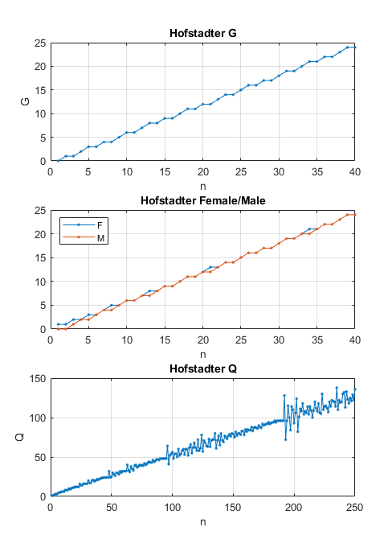

# Hofstadter Sequences in MATLAB (G, F/M, Q)

Small MATLAB demo that generates and plots Hofstadter sequences:
**G**, **Female/Male (F/M)**, and **Q**. A quick demonstration of
self-referential/meta-Fibonacci sequences.



## Requirements
- MATLAB (R2020a+ recommended)

## Quick start

1. Open `HofstadterSequences.m` in MATLAB, adjust the parameters at the top, then run it.

## Sequences implemented (definitions)

### G sequence (Hofstadter G)

Recurrence (zero-based definition):

```math
\begin{gather}
G(0)=0, \\
G(n)=n−G⁣(G(n−1)) \quad \text{for} \quad n≥1.
\end{gather}
```
<br/>

The $(n-1)\text{th}$ element determines which element is subtracted from the $n\text{th}$.


In MATLAB, G(1)=0 is used to represent G(0)=0 (shifted for 1-based arrays).

### Female / Male sequences (F and M)

Mutually recursive pair (zero-based definition):


```math
\begin{gather}
F(0)=1, \quad M(0)=0, \\
F(n)=n−M(F(n−1)), \\
M(n)=n−F(M(n−1)).
\end{gather}
```
<br/>

The $(n-1)\text{th}$ element of a sequence determines which element of the other sequence is subtracted from the $n\text{th}$ element of the sequence.

In the MATLAB code, 1-based indexing is used.

### Q sequence (Hofstadter Q)

Zero-based definition:

```math
\begin{gather}
Q(0)=1, \quad Q(1)=1, \\
Q(n)=Q⁣(n−Q(n−1))+Q⁣(n−Q(n−2)) \quad \text{for} \quad n≥2.
\end{gather}
```
<br/>

The $(n-1)\text{th}$ and $(n-2)\text{th}$ elements of the sequence determine which elements are summed for the $n\text{th}$ element. Produces chaotic behaviour, it is unknown whether the sequence stops by reaching a negative index.

In the code, 1-based indexing is used.
